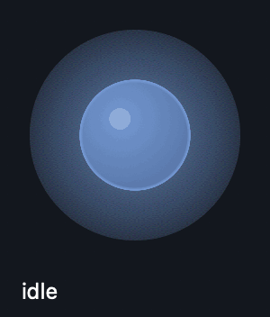

# 🔮 Ollie

A voice companion for terminal coding agents. Talk to inject text at your
cursor; hear new, meaningful agent output read back. A floating orb shows what
it is doing so you can lean back and stop watching the terminal.

Not an autonomous agent — a speech-in / narration-out bridge. Everything runs
on your Mac; no cloud API anywhere in it.

Currently speaks Claude Code on macOS, Apple Silicon.



## How it works

```
                 ┌── ClaudeCodeReader ──┐
  ~/.claude/*.jsonl  tail + parse        │  {role, text}
                 └──────────────────────┘
                            │
                    Ollama filter/dedup      qwen2.5:3b-instruct
                    "is this new? say it     holds spoken-history memory,
                     in one short line"      condenses diffs and logs
                            │
                       macOS `say`  ──────►  🔊
                            │
                       amplitude ─────────►  🔮 orb

  🎤 hold ⌥R ─► mlx-whisper base.en ─► ⌘V into the focused terminal
```

## Install

Requirements: an Apple Silicon Mac, Python 3.10+, [uv](https://docs.astral.sh/uv)
(`brew install uv`), [Ollama](https://ollama.com) (`brew install ollama`)
running with the filter model pulled, and Node.js (`brew install node`) for
the bundled [lookup-ai](docs/lookup-ai.md) companion.

```bash
git clone <this repo> ollie && cd ollie      # or wherever you keep it

ollama pull qwen2.5:3b-instruct

uv venv --python 3.12 .venv
uv pip install --python .venv/bin/python -e .              # core
uv pip install --python .venv/bin/python -e '.[kokoro]'    # + neural TTS (optional)

(cd lookup-ai && npm install)                               # Ask AI on selection companion

.venv/bin/python scripts/make_app.py --run                 # build + launch Ollie.app
```

Skipping the `npm install` step isn't fatal — Ollie just logs a warning and
runs without the [lookup-ai](docs/lookup-ai.md) companion until it's done.

This builds `/Applications/Ollie.app` and launches it — the standard location,
so it appears in the Privacy & Security permission pickers. Running it as an
app rather than a script matters: it gives Ollie
[its own permission identity](docs/design-notes.md#why-the-app-bundle-is-a-c-program)
instead of handing the grant to your terminal.

The Whisper model (~290 MB) and, if you use it, the Kokoro model (~330 MB)
download themselves from Hugging Face on first run.

### Permissions

Each of these fails *silently* without its grant — this is the step people
miss. Ollie requests them on first launch, so it appears in each list on its
own; just flip the toggles in System Settings → Privacy & Security (don't use
the + button).

| Permission | Why | Symptom when missing |
|---|---|---|
| **Input Monitoring** | hear the push-to-talk key | holding the key does nothing |
| **Accessibility** | paste transcribed text into your terminal | speech transcribes but nothing appears |
| **Microphone** | record while the key is held | recordings are pure silence |
| **Screen Recording** | only for [computer use](docs/autopilot.md#computer-use) | autopilot can't click in a pinned window |

Then **quit Ollie (right-click the orb) and relaunch once** — the key listener
only picks up grants at startup.

The [lookup-ai](docs/lookup-ai.md) companion is a separate app and needs its
own Accessibility grant (to read your text selection) the first time you use
**Ask AI on selection** — a second entry in the same System Settings list,
easy to miss since it's not named "Ollie".

Check them any time with `./run.sh --doctor`, or in the orb menu →
**Permissions**, which shows each one's live status. The two differ on
purpose: permissions belong to a *process*, so `--doctor` from a terminal
reports your terminal's grants, while the menu reports the app's. If a grant
stops working after a rebuild, that's
[expected and fixable](docs/design-notes.md#why-rebuilding-revokes-the-grant).

## Use it

**Speak:** hold the **right Option (⌥)** key, talk, release. Your words are
transcribed and pasted at the cursor of whatever terminal is focused. Nothing
is submitted until you press Return yourself — pass `--press-enter` if you want
it sent immediately. Talking also interrupts whatever Ollie is currently
saying.

**Orb:** drag it anywhere. Clicks outside the circle pass through to the window
underneath, so it never gets in your way. Hover for the mute / autopilot /
computer-use toggles; right-click for the full menu — style, voice, tone,
microphone, models, permissions, and what to watch.

**Ask AI on selection:** select text anywhere on your Mac, press **⌘E**, and
ask an AI about it in a popup that appears at your cursor — a separate small
app ([lookup-ai](docs/lookup-ai.md)) that Ollie starts and stops alongside
itself. On by default; toggle from the orb menu.

Ollie attaches to your most recently active Claude Code session and joins it at
the tail, so it never replays history at you. Start a new session in any
directory and it follows automatically. Orb menu → **Watch** points it at any
other open window instead.

## More

| | |
|---|---|
| [Voice, tone and narration styles](docs/voice.md) | how much you hear, who says it, and how it's written |
| [Ask AI on selection](docs/lookup-ai.md) | the bundled lookup-ai companion — shortcut, backends, models, troubleshooting |
| [Autopilot](docs/autopilot.md) | let the local model drive the agent — and click, with computer use |
| [Reference](docs/reference.md) | tuning flags, models, running from a terminal, tests, layout |
| [Design notes](docs/design-notes.md) | why the launcher is a C program, and other things that fought back |
