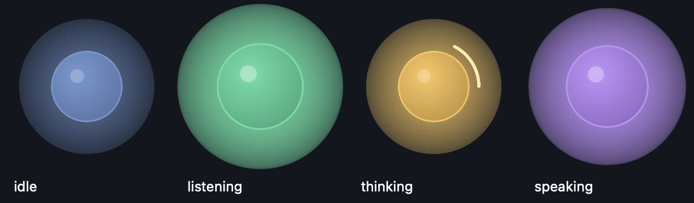

# 🔮 Ollie

A voice companion for terminal coding agents. Talk to inject text at your
cursor; hear new, meaningful agent output read back. A floating orb shows what
it is doing so you can lean back and stop watching the terminal.

Not an autonomous agent — a speech-in / narration-out bridge.

**Phase 1 (this release): Claude Code on macOS, Apple Silicon.**



## How it works

```
                 ┌── ClaudeCodeReader ──┐
  ~/.claude/*.jsonl  tail + parse        │  {role, text}
                 └──────────────────────┘
                            │
                    Ollama filter/dedup      qwen2.5:3b-instruct
                    "is this new? say it     holds spoken-history memory,
                     in one short line"      condenses diffs and logs
                            │
                       macOS `say`  ──────►  🔊
                            │
                       amplitude ─────────►  🔮 orb

  🎤 hold ⌥R ─► mlx-whisper base.en ─► ⌘V into the focused terminal
```

The **reader** is the only component that knows where output comes from.
Everything downstream is source-agnostic — that is the seam Phase 2 (Codex CLI)
and Phase 3 (generic terminal via the Accessibility API) plug into. See
`ollie/readers/base.py` for the contract.

Tailing the session JSONL rather than scraping the terminal means no ANSI
escapes, no redraw/spinner noise, and clean role information for free.

Latency is roughly 2–4 seconds end to end. Stages run sequentially on purpose;
optimise only if it starts to bother you.

## Install

Requirements: an Apple Silicon Mac, Python 3.10+, [uv](https://docs.astral.sh/uv)
(`brew install uv`), and [Ollama](https://ollama.com) (`brew install ollama`)
running with the filter model pulled.

```bash
git clone <this repo> ollie && cd ollie      # or wherever you keep it

ollama pull qwen2.5:3b-instruct

uv venv --python 3.12 .venv
uv pip install --python .venv/bin/python -e .              # core
uv pip install --python .venv/bin/python -e '.[kokoro]'    # + neural TTS (optional)

.venv/bin/python scripts/make_app.py --run                 # build + launch Ollie.app
```

The Whisper model (~290 MB) and, if you use it, the Kokoro model (~330 MB)
download themselves from Hugging Face on first run.

### Grant the three permissions

Ollie needs all three, and each fails *silently* without them — this is the
step people miss. System Settings → Privacy & Security:

| Permission | Why | Symptom when missing |
|---|---|---|
| **Input Monitoring** | hear the push-to-talk key | holding the key does nothing |
| **Accessibility** | paste transcribed text into your terminal | speech transcribes but nothing appears |
| **Microphone** | record while the key is held | recordings are pure silence |

Ollie requests all three on first launch, so it appears in each list on its
own — just flip the toggles (don't use the + button). Then **quit Ollie
(right-click the orb) and relaunch once**: the key listener only picks up
grants at startup.

Verify everything at once:

```bash
./run.sh --doctor
```

One nuance: permissions belong to a *process*, so `--doctor` from a terminal
reports your terminal's grants; the app's own view is in the orb menu →
Settings & dependencies. If a grant ever stops working after a rebuild, remove
the stale row in System Settings and relaunch — and if the row itself refuses
to update, `tccutil reset Accessibility com.swastikroy.ollie` clears it.

## Run it as an app (recommended)

```bash
.venv/bin/python scripts/make_app.py --run
```

This builds `/Applications/Ollie.app` and launches it — the standard
location, so it appears in the Privacy & Security permission pickers.

macOS grants Accessibility and Microphone to an **application**, not to a
script. Run `python -m ollie` from a shell and the grant lands on your terminal
— so every script that terminal ever runs inherits the ability to read your
keystrokes and drive your machine. Inside the bundle the grant belongs to Ollie
alone, and the permission dialogs say "Ollie".

Getting that right takes more than a folder with an `Info.plist`. The obvious
wrapper — a shell script that `exec`s the interpreter — does **not** work:
`exec` replaces the process image, so macOS attributes the permission to the
Python binary and Accessibility lists a bare "python 3.12". So Ollie's
`Contents/MacOS/Ollie` is a small C program that links libpython and calls
`Py_BytesMain` directly. The process image never changes, the running process
really is the bundle, and TCC sees Ollie. `scripts/launcher/main.c` is about
sixty lines and `make_app.py` compiles it with clang.

On first launch macOS asks for Microphone, then Accessibility. **Grant
Accessibility, then quit and relaunch Ollie once** — the key listener only
picks up the new permission at startup. If Accessibility still lists a stale
`python 3.12` entry from an earlier attempt, remove it.

The bundle stays a thin wrapper (~1.4 MB): it points at this project's
virtualenv, so edits to the Python take effect on the next launch with no
rebuild — and, importantly, without disturbing the permission.

**Rebuilding revokes the grant.** macOS keys Accessibility to the bundle's code
signature, and re-signing produces a new seal even when nothing changed. So
`make_app.py` compares a manifest of its inputs (launcher source, `orb.py`,
paths, `Info.plist`) and does nothing at all when they match. You only re-grant
when the app genuinely changed: a new launcher, a new icon, or a moved project.
Byte-comparing the built binary would not work — the linker stamps a fresh
LC_UUID on every build, so no two builds are ever identical.

No Dock icon, no menu bar. **Right-click the orb** to mute, open the log, jump
to Accessibility settings, or quit. The full log is `~/.ollie/ollie.log`;
`~/.ollie/app.log` catches raw stdout and stderr, including crashes.

```bash
python scripts/make_app.py --dest /Applications   # somewhere else
```

## Run from a terminal

Handy while developing, since you see the logs live:

```bash
./run.sh                 # narrator + floating orb
./run.sh --no-orb        # headless, logs to stderr and ~/.ollie/ollie.log
./run.sh --list-sessions # which transcripts it can see; * is the active one
./run.sh --say "hello"   # TTS smoke test
```

This needs your *terminal* to hold the Accessibility grant.

Ollie attaches to your most recently active Claude Code session and joins it at
the tail, so it never replays history at you. Start a new session in any
directory and it follows automatically.

**Speak:** hold the **right Option (⌥)** key, talk, release. Your words are
transcribed and pasted at the cursor of whatever terminal is focused. Nothing
is submitted until you press Return yourself — pass `--press-enter` if you want
it sent immediately. Talking also interrupts whatever Ollie is currently
saying.

**Orb:** drag it anywhere. Clicks outside the circle pass through to the window
underneath, so it never gets in your way. Right-click to quit.

### Pin the session with a hook (optional)

Instead of guessing the newest transcript, let Claude Code tell Ollie which
session started:

```bash
.venv/bin/python scripts/install_hook.py     # --uninstall to undo
```

This registers a `SessionStart` hook that records the session id and transcript
path in `~/.ollie/current_session.json`. Your existing `~/.claude/settings.json`
is backed up first.

## Narration styles

| Style | What you hear | Model in the loop |
|---|---|---|
| `brief` (default) | One terse line; routine steps skipped | yes |
| `full` | Loss-less retelling — every action, file, number and question kept, several sentences allowed | yes |
| `verbatim` | The agent's own words, lightly cleaned for speech (markdown stripped, code fences elided); URLs and paths are read as written | no |

Switch with `--style full`, by right-clicking the orb, or by setting `style`
in `~/.ollie/config.json`. Changes made from the orb menu persist.

## Autopilot

Armed, Ollie stops being a narrator and becomes a driver: at the end of each
agent turn it hands your goal plus the agent's latest output to the local
model, which either declares the goal achieved or authors the next instruction
— typed into the terminal with Enter pressed.

```bash
./run.sh --autopilot --goal "make the failing tests in test_auth pass"
```

Or arm it live: right-click the orb → **Autopilot — arm**, then hold the talk
key and *speak* the goal. The orb wears a pulsing amber ring while armed.

The first prompt sent is your goal, verbatim. After that the model reacts to
whatever the agent did: answers its questions decisively, tells it to fix its
errors, pushes it to the next step, and replies `DONE` when the output shows
the goal is met (spoken aloud: "Goal complete").

Guardrails, because autopilot types into your focused window:

- injects **only while a terminal app is frontmost** (list configurable via
  `autopilot_frontmost`); otherwise it waits, tells you, and gives up after 3
  minutes
- hard cap of `autopilot_max_turns` (default 15) per goal
- authoring the same instruction twice in a row = stalled → disarms and says so
- authored text that just echoes the agent's output is discarded, never typed
- disarm any time from the orb menu; speaking a new goal always wins

Turn ends are detected from the transcript's own end-of-turn records, with an
idle timer (`autopilot_idle`, 75s) as fallback. If Ollama is unreachable the
turn is skipped and retried — nothing is ever injected on a failure path.

## Voice and tone

**Engine** is what synthesises. Two options, switchable live from the orb's
**Engine** menu or `--engine`:

| Engine | Sound | Cost |
|---|---|---|
| `say` (default) | classic macOS voices | zero setup, instant |
| `kokoro` | neural (Kokoro-82M via MLX), noticeably more natural | install with `-e '.[kokoro]'`, one-time ~330 MB model download, ~2s warmup at launch |

Warm Kokoro synthesis runs ~50× real time on Apple Silicon — about 0.15s for
six seconds of speech — so it adds nothing perceptible to the narration cycle,
and it falls back to `say` per-utterance if anything goes wrong. Kokoro voices
(`af_heart`, `am_adam`, `bf_emma`, …) appear in the Voice menu when the engine
is active; `kokoro_speed` in the config trades pace for clarity.

**Voice** is who speaks: any installed macOS voice. `./run.sh --list-voices`
shows what you have (System Settings → Accessibility → Spoken Content →
Manage Voices to download nicer ones — the Siri and Enhanced voices work).
Pick from the orb's right-click **Voice** menu (you hear a preview instantly),
or `--voice Daniel --rate 190`.

**Tone** is how the narration is written, applied at the filter — facts stay
identical across tones:

| Tone | Flavour |
|---|---|
| `neutral` (default) | plain colleague-over-the-shoulder |
| `warm` | friendly, encouraging |
| `snarky` | dry wit — about the code, never about you |
| `minimal` | telegraphic, fewest words that carry every fact |

Orb menu → **Tone**, or `--tone snarky`. Verbatim style ignores tone, since
there the agent's own words are the whole point.

## Tuning

Flags override `~/.ollie/config.json`, which overrides the defaults in
`ollie/config.py`. Every field also reads from `OLLIE_<FIELD>` in the
environment.

| What | How |
|---|---|
| Quieter narration | `--no-tools` (prose only) |
| Noisier narration | `--tool-results` (also reads command output) |
| Different voice | `--voice Daniel --rate 190` (`say -v '?'` to list) |
| Different filter model | `--model llama3.2:3b` |
| Different hotkey | `--hotkey "caps lock"`, `--hotkey f13`, `--hotkey-mode toggle` |
| Find a working key | `./run.sh --test-hotkey` prints every key you press |
| Type instead of paste | `OLLIE_INJECT_MODE=type` |
| Better transcription | `OLLIE_WHISPER_REPO=mlx-community/whisper-small.en-mlx` |

Hotkeys can be named the way they are printed on your keyboard — `"right
option"`, `"option"`, `"right command"`, `"caps lock"`, `f13` — or by the
internal names (`alt_r`, `cmd_r`) if you prefer.

Useful knobs that have no flag: `batch_debounce` (how long events are gathered
before one narration pass — raise it for fewer, denser sentences),
`history_window` (how many spoken lines the filter remembers), `max_words`.

## Design notes

**Why the raw shell command never reaches the model.** A 3B model handed
`cd /repo && KMP_DUPLICATE_LIB_OK=TRUE .venv/bin/python -c "import torch..."`
will simply read it back to you. `summarize_command()` in the reader turns it
into `running a python snippet` first. The filter is also given few-shot
examples, and any output that is just a tool event echoed back is dropped
(`OllamaFilter._is_echo`).

**Degradation.** If Ollama is down the filter falls back to a deterministic
local condense rather than going silent. If `say` cannot synthesise to a file
it falls back to speaking directly, losing only the amplitude animation. If
clang is missing, `make_app.py` falls back to a shell launcher and says so —
the app still runs, it just loses its own permission identity.

**Logging goes to a duplicated file descriptor.** PortAudio's CoreAudio backend
points fd 2 at `/dev/null` while it initialises, to hide its own chatter, and
restores it afterwards. Anything logged in that window vanishes — which quietly
ate the startup lines until `_setup_logging` started handing the console
handler its own `os.dup` of stderr.

**The reader never replays.** It tracks inode, size and the first 256 bytes of
the transcript, so a rotated, truncated or rewritten file is detected and
reread instead of producing garbage from a stale offset. Chunks are deduped by
tool-use id and message uuid, so the same line is never spoken twice.

Thinking blocks and subagent sidechains are never spoken.

## Settings & dependency report

`./run.sh --settings` prints, and orb menu → **Settings & dependencies…**
opens as a page, a live inventory of everything Ollie stands on: which models
are in use and their on-disk size (Whisper, the Ollama filter/autopilot
models, Kokoro), which macOS APIs are involved and whether each permission is
currently granted for that process, where the transcripts, config and logs
live, and the versions of every library in the stack. All of it is gathered
at render time — it is a health check, not a brochure. Everything listed runs
on this Mac; no cloud API appears anywhere in it.

## Tests

```bash
uv pip install --python .venv/bin/python -e '.[dev]'
.venv/bin/python -m pytest tests -q
```

`scripts/render_orb.py` renders the four orb states to a PNG contact sheet
offscreen — handy for tweaking the visuals without launching the app.

## Layout

```
ollie/
  readers/base.py         the Reader contract — the swap point
  readers/claude_code.py  tail + parse the Claude Code session JSONL
  filter.py               Ollama dedup/condense, spoken-history memory
  tts.py                  `say` -> WAV -> playback with amplitude
  stt.py                  mlx-whisper, push-to-talk capture
  injector.py             pasteboard + synthesised ⌘V (or unicode typing)
  hotkey.py               global push-to-talk listener
  orb.py                  always-on-top transparent Cocoa window
  core.py                 the shared source-agnostic core loop
scripts/
  make_app.py             build Ollie.app (bundle, icon, ad-hoc signature)
  launcher/main.c         the native launcher that gives the app its own TCC identity
  install_hook.py         register the Claude Code SessionStart hook
  session_hook.py         the hook itself
  render_orb.py           offscreen orb preview
```

## Roadmap

- **Phase 2** — Codex CLI reader.
- **Phase 3** — generic terminals via the macOS Accessibility API: poll the
  terminal's AX text tree ~2×/s and diff snapshots through the local model
  (not a character diff) to suppress redraws, spinners and progress bars.
  Fallback path only.
